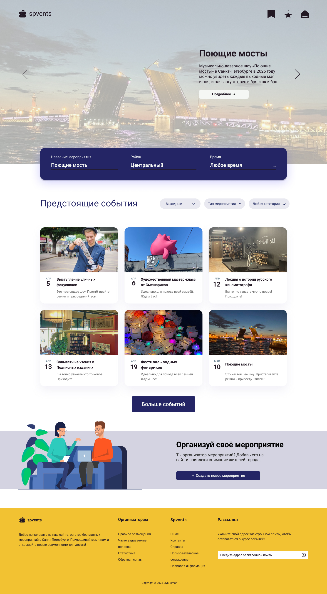
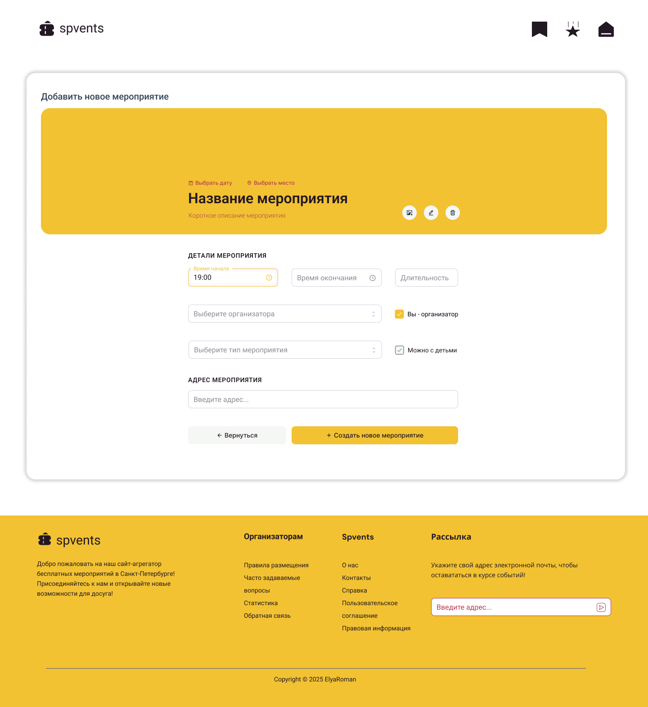
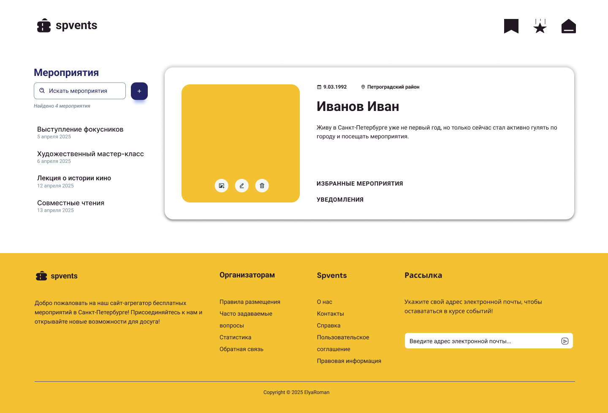

# :performing_arts: spvents

Сайт с бесплатными мероприятиями в Санкт-Петербурге с функцией добавления мероприятий жителями города.

## 💻 О проекте
Проект был реализован в рамках дипломной практики Клюевой Алёной, студентом 4 курса факультета ПИН университета ИТМО. 

## :art: Макеты страниц

Были нарисованы с помощью [Figma](https://www.figma.com/design/MmajFwC68UUJzpW748v32l/%D0%BF%D1%80%D0%B0%D0%BA%D1%82%D0%B8%D0%BA%D0%B0?node-id=14-28&t=IOjwaF0ZlSBkamCV-1), графического онлайн-редактора.

| Главная страница | Страница добавления мероприятий | Личный кабинет |
|-------------|-------------|-------------|
|  |  |  |

## 📂 Структура проекта
```
spvents 
├── index.html                # Главная страница 
├── add-event.html            # Страница добавления мероприятий 
├── account.html              # Страница личного кабинета 
├── css                       # Стили CSS 
│   └── style.css 
│   └── style.css.map 
├── scss                      # Препроцессоры SCSS 
│   └── global                # Глобальные стили
│       └── (файлы стилей) 
│   └── blocks                # Стили компонентов
│       └── (файлы стилей) 
├── fonts                     # Шрифты 
│   └── (файлы шрифтов) 
├── images                    # Изображения 
│   └── (файлы изображений) 
└── favicon                   # Фавконка
    └── (файлы иконок)
└── site.webmanifest          # Отображение фавиконки
```
